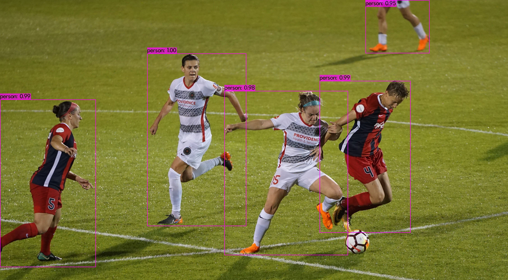

# Compiling `yolov4` in the `darknet` framework on Windows using `vcpkg`

According to https://github.com/AlexeyAB/darknet, this is the recommended approach to build `Darknet` on Windows.

## Preliminaries
Make sure you have the following requirements satisfied:

1. CMake >= 3.18
2. Powershell (already installed on Windows)
3. CUDA >= 10.2
4. OpenCV >= 2.4
5. cuDNN >= 8.0.2
6. GPU with CC >= 3.0

**Remarks**: 
* For info for WSL CUDA users please see https://docs.nvidia.com/cuda/wsl-user-guide/index.html.
* For downloading the CUDA driver please go to: https://developer.nvidia.com/cuda/wsl.
* Some features are restricted and are only available to members of 
the [Microsoft Windows Insider Program](https://insider.windows.com/en-us/getting-started/), as well as to
these members who are also registered in the [NVIDIA Developer Program](https://developer.nvidia.com/developer-program).
* It is recommended to sign up for the [Beta Channel](https://insider.windows.com/en-us/) of the 
Windows Insider Program and upgrade to Windows 11 for a more seamless developer experience.
* Make sure to set the environment variable `PATH` for both `ninja` and `vcpkg` before attempting to compile. 
* You may find the `ninja` executable as part of Visual Studio 2019 Community Edition, at a location similar to
`C:\Program Files (x86)\Microsoft Visual Studio\2019\Community\Common7\IDE\CommonExtensions\Microsoft\CMake\Ninja\ninja.exe`
* And for `vcpkg`, it is best to install it at a location called
`C:\src` as suggested in their official docs on GitHub: https://github.com/microsoft/vcpkg. 


## Installation Instructions
1. Install Visual Studio 2019. In case you need to download it, please download the Community Edition. 
Remember to install English language pack, as this is mandatory for `vcpkg`.
2. Install CUDA enabling VS Integration during installation from the link above in the [Preliminaries](#preliminaries).
3. Use Powershell to run the following commands one-by-one, at a directory such as `C:\Users\<username>`:
   ```shell
   Set-ExecutionPolicy unrestricted -Scope CurrentUser -Force
   git clone https://github.com/AlexeyAB/darknet.git
   cd darknet
   .\build.ps1 -UseVCPKG -EnableOPENCV -EnableCUDA -EnableCUDNN -EnableOPENCV_CUDA
   ```

The entire compilation process may take hours, so be prepared to set aside sufficient time to allow for monitoring its
completion. Once finished, you should be able to find the executable "darknet.exe" in the "root" `darknet` directory.


## Setup
Remember to download the "yolov4.weights" as indicated in AlexeyAB's version of `darknet` and put it in the "yolov4/"
directory, along with the necessary files in the "cfg" and "data" directories before running each detection.
1. More specifically, please check if the "data\labels" copied directly from the "darknet" repository with all its
contents are put in the new "data" directory under "yolov4". 
2. Also, need to check are the "coco.data" file, together with the original "yolov4.cfg" files are in the "cfg" directory. 
3. Please put the modified "coco.names" file along with any data file you would like to carry out the object detection 
on in the "data" folder.


## Testing
### For an image
Do something similar to the following at the command prompt:
```shell
darknet.exe detector test cfg\coco.data cfg\yolov4.cfg yolov4.weights -ext_output data\people1.jpg -out result.json
```

## Example Output
The current setup is to use the weights from the MS COCO dataset, but showing only detection for the "person" class.
Other objects are not shown in the output at all, unless the `dont_show` option is removed from the front of each line
for the particular objects concerned. 

One image with detection results shown is as follows:



## Manually Build of `opencv-python` to Include `dnn` Module with NVIDIA GPU
1. First, clone the `opencv-python` repository:
```shell
git clone https://github.com/opencv/opencv-python.git
```

2. Then, change the directory to `opencv-python` so it becomes the root directory:
```shell
cd opencv-python
```

3. Add custom cmake flags as follows:
```shell
set CMAKE_ARGS="-DWITH_CUDA=ON -DWITH_CUDNN=ON -DOPENCV_DNN_CUDA=ON -DWITH_CUBLAS=ON"
```

4. Next, select the package flavors which you wish to build with ENABLE_CONTRIB and ENABLE_HEADLESS:
```shell
set ENABLE_CONTRIB=1
```
This will enable building `opencv-contrib-python`. 

5. To start the installation, run:
```shell
pip wheel . --verbose
```
Note: Make sure you have the latest `pip` version, 
as the pip wheel command replaces the old `python setup.py bdist_wheel` command 
which does not support "pyproject.toml". 

If your build is successful, you should be able to see the line
```shell
Successfully built opencv-contrib-python
```
towards the very end of the output generated for the build. 

6. Install the wheel
Once the wheel is built, you should be able to locate it in the root directory:
```shell
pip install some-file.whl
```
For an example, this file can have the name 
"C:/Users/kriss/opencv-python/opencv_contrib_python-4.5.3+f07201c-cp39-cp39-win_amd64.whl". 
